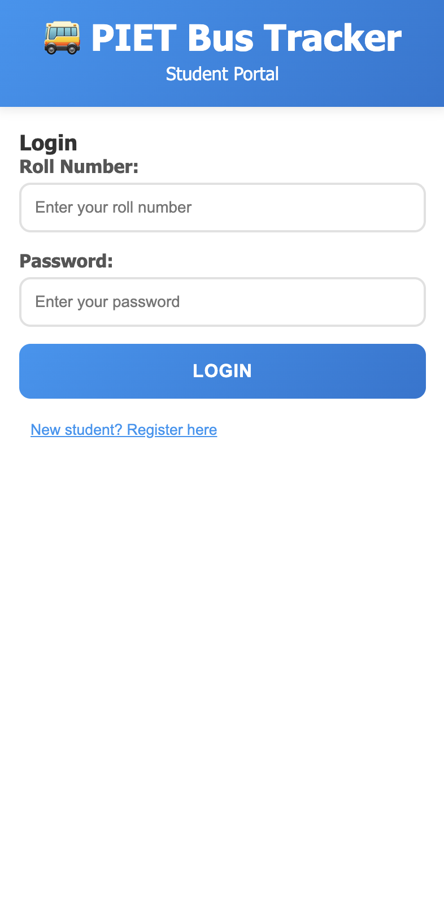
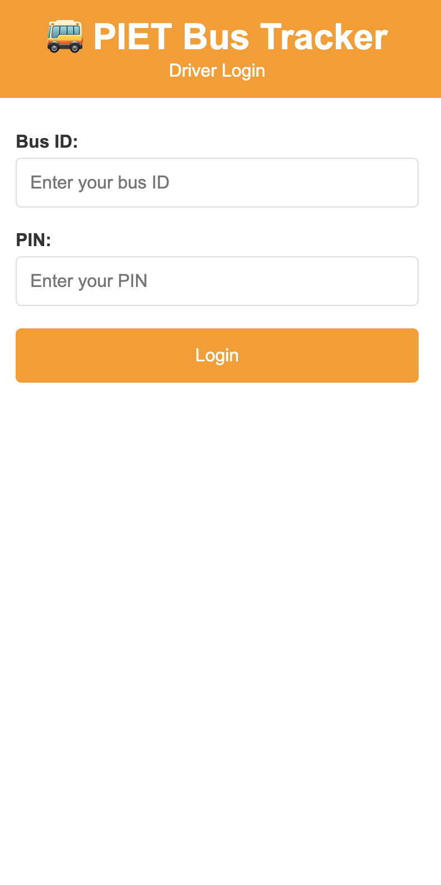
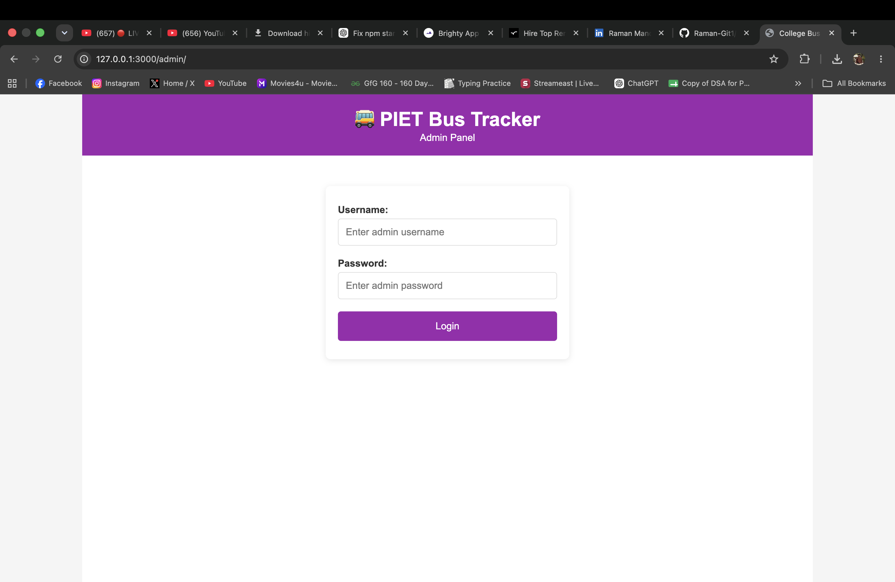
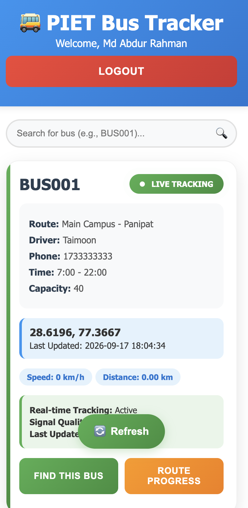
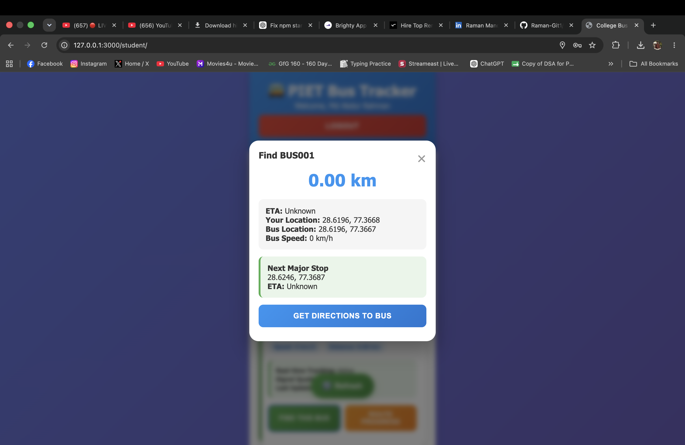
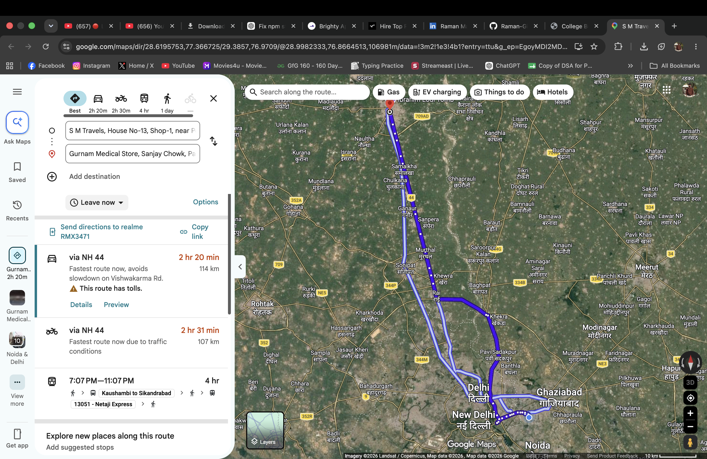
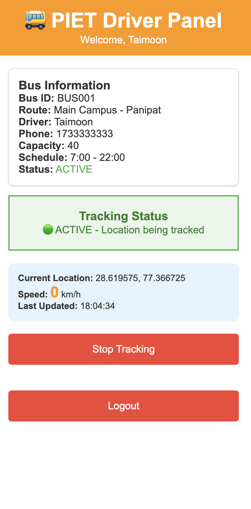
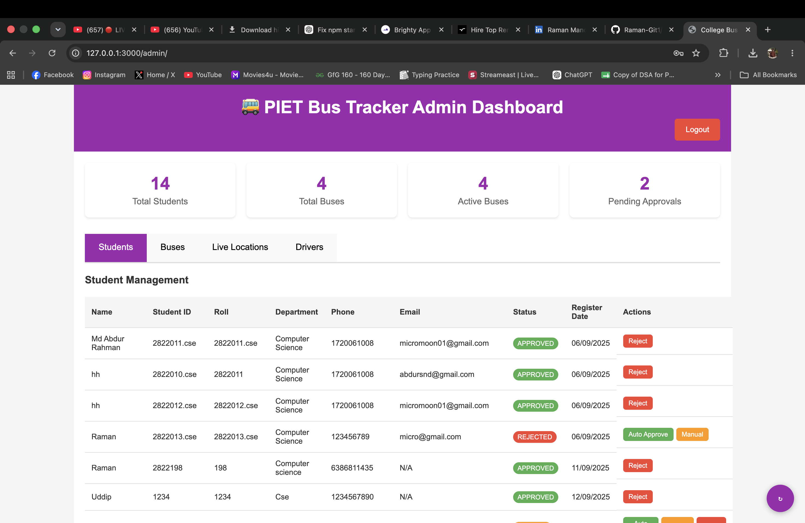

# College Bus Tracker

<p align="center">
  
  
  
  
  
  
</p>

A real-time campus transportation platform designed to improve student commute visibility, simplify driver tracking, and give administrators a unified control layer for fleet coordination.

## Overview

This project solves a practical problem for campus life: students often wait without knowing when a bus will arrive, drivers need a simple way to share live location, and admin staff need visibility into fleet status.

The solution is a lightweight web application that combines a student-facing tracker, driver dashboard, and admin control panel into one cohesive system.

## Product Showcase

<p align="center">
  <table>
    <tr>
      <td width="50%" align="center">
        
        <br /><strong>1. Student Login</strong>
      </td>
      <td width="50%" align="center">
        
        <br /><strong>2. Driver Login</strong>
      </td>
    </tr>
    <tr>
      <td width="50%" align="center">
        
        <br /><strong>3. Admin Login</strong>
      </td>
      <td width="50%" align="center">
        
        <br /><strong>4. Bus Information</strong>
      </td>
    </tr>
    <tr>
      <td width="50%" align="center">
        
        <br /><strong>5. Direction to Bus</strong>
      </td>
      <td width="50%" align="center">
        
        <br /><strong>6. Live Tracking</strong>
      </td>
    </tr>
    <tr>
      <td width="50%" align="center">
        
        <br /><strong>7. Driver Panel</strong>
      </td>
      <td width="50%" align="center">
        
        <br /><strong>8. Admin Dashboard</strong>
      </td>
    </tr>
  </table>
</p>

## Why This Project Matters

- Reduces commute uncertainty for students through live bus visibility
- Improves operational transparency for campus transport management
- Uses lightweight, cost-effective technologies for fast deployment
- Demonstrates product thinking, UI/UX design, and real-time data workflows
- Shows how a practical business problem can be solved with a clean full-stack web experience

## Key Highlights

- Real-time tracking across multiple user roles
- Responsive interface for mobile and desktop users
- Spreadsheet-backed data layer for rapid prototyping and deployment
- Role-based access for students, drivers, and administrators
- Clear workflow from GPS capture to live location visibility

## Core Features

### Student Experience
- Secure login using roll number and password
- View all bus routes and schedules
- Monitor live bus locations on a map
- See next stop and route information
- Auto-refresh tracking data for near real-time updates

### Driver Experience
- Driver login with bus ID and PIN
- Share live GPS coordinates from the browser
- Start or stop tracking for the assigned bus
- Display current speed and location metadata
- Sync updates directly into Google Sheets

### Admin Experience
- Manage student accounts and status approvals
- Control bus activation and route visibility
- View live fleet movement from one dashboard
- Monitor driver activity and system health

## Tech Stack

- Frontend: HTML, CSS, JavaScript
- Data Layer: Google Sheets API
- Mapping: Google Maps JavaScript API
- Hosting: Static web hosting (GitHub Pages, Netlify, or local server)
- Architecture: Serverless-style static app using spreadsheet-backed storage

## System Architecture

```text
┌───────────────────┐      ┌───────────────────┐      ┌────────────────────┐
│ Student App       │────▶ │ Google Sheets     │ ◀──▶ │ Driver App         │
│ - Login           │      │ - Bus data        │      │ - GPS tracking     │
│ - Bus list        │      │ - Live locations  │      │ - Location update  │
│ - Route tracking  │      │ - Driver records  │      │ - Speed monitor    │
└───────────────────┘      └───────────────────┘      └────────────────────┘
          │                                                  │
          └──────────────────────────────┬───────────────────────┘
                                         │
                              ┌──────────────┐
                              │ Admin Panel  │
                              │ - Dashboard  │
                              │ - Monitoring │
                              │ - Control    │
                              └──────────────┘
```

## Project Structure

```text
college-bus-tracker/
├── index.html                 # Main entry / student landing page
├── student/
│   ├── index.html             # Student interface
│   ├── script.js              # Student logic and Google Sheets integration
│   └── styles.css             # Student UI styling
├── driver/
│   └── index.html             # Driver tracking interface
├── admin/
│   └── index.html             # Admin dashboard
├── shared/
│   └── api.js                 # Shared API helpers
├── images/                    # UI assets
├── README.md                  # Project documentation
├── vercel.json                # Hosting config
├── package.json               # Local static server setup
└── .htaccess                  # Routing / hosting support
```

## Quick Start

### 1. Google Sheets Setup
A demo spreadsheet is already configured with the following sheet structure:

- Students
- Buses
- LiveLocations
- Drivers

Dataset reference:
- Sheet ID: `1Tm7lhBZzK5xaz_Sr3lVxkmQTzuiagllhlRpDYjpD4XU`

### 2. API Configuration
Create your own local config file from the example template and keep your values there instead of committing them to the repository.

```bash
cp config.example.js config.js
```

Then update the values in `config.js` with your own Google API key and Sheet ID.

### 3. Local Run

```bash
npm install
npm start
```

Then open:
- Student app: `http://localhost:3000/student/`
- Driver app: `http://localhost:3000/driver/`
- Admin app: `http://localhost:3000/admin/`

You can also run:

```bash
npx http-server ./ -p 3000
```

## Demo Credentials

### Student Login
- Roll: `2822011.cse`
- Password: `123456`

### Driver Login
- Bus ID: `BUS001`
- PIN: `1234`

### Admin Login
- Username: `admin`
- Password: `admin123`

## Data Model

### Students
| Field | Description |
|---|---|
| Name | Student name |
| StudentID | Unique academic ID |
| Roll | Student roll number |
| Department | Department name |
| Phone | Contact information |
| Password | Demo auth credential |
| Status | Approved / pending |
| RegisterDate | User registration date |

### Buses
| Field | Description |
|---|---|
| BusID | Unique bus identifier |
| Route | Route name / path |
| Driver | Assigned driver name |
| Phone | Driver contact |
| Capacity | Maximum passengers |
| Status | Active / inactive |
| StartTime | Route start time |
| EndTime | Route end time |
| RouteKey | Route identifier |

### LiveLocations
| Field | Description |
|---|---|
| BusID | Associated bus |
| Latitude | GPS latitude |
| Longitude | GPS longitude |
| Speed | Live speed |
| LastUpdate | Last update timestamp |
| NextStop | Upcoming stop |

## Deployment Options

### GitHub Pages
1. Push the project to a GitHub repository
2. Enable GitHub Pages in the repo settings
3. Publish the static site

### Netlify
1. Drag and drop the project folder into Netlify
2. Select the root directory
3. Publish and access the live URL

### Vercel
The repository includes `vercel.json` for static deployment compatibility.

## Production Considerations

This project is intentionally built as a practical demo, but for production-grade deployment the following would be required:

- Secure authentication with JWT or session-based auth
- Encrypted storage for sensitive user data
- Proper role-based access control
- Environment variables instead of hardcoded keys
- HTTPS enforcement in production
- Input validation and rate limiting
- Database migration from Google Sheets to a real backend system

## Security Notes

> This is a demo application. Some credentials and API values are embedded in the frontend for quick testing and demonstration purposes.

For production, avoid:
- Hardcoded API keys in client-side code
- Plain-text password storage
- Exposing admin credentials in public files
- Unrestricted Google Sheets access

## Roadmap

- Replace spreadsheet storage with a secure backend
- Add real user authentication and authorization
- Introduce live notification and ETA features
- Add route analytics and fleet insights
- Improve admin dashboard UX and reporting
- Implement mobile-first native-like interactions

## Troubleshooting

### Common Problems

#### API key or sheet access errors
- Confirm the Sheets API is enabled
- Verify the Google Sheet is publicly readable or properly authorized
- Ensure the project domain matches the allowed restrictions

#### GPS not updating
- Check browser location permission access
- Use HTTPS for production
- Test on a mobile device with GPS enabled

#### Login failures
- Verify the sheet headers and exact values
- Check for case sensitivity mismatches
- Confirm data is present in the correct row and sheet

## Project Impact

This project reflects a product-minded engineering approach: a clean user experience, a practical real-world problem, and a deployable system built from accessible web technologies.

It demonstrates core software development strengths including:

- user-centered design and interface thinking
- real-time data synchronization workflows
- multi-role application architecture
- API integrations with third-party services
- deployment readiness and production-aware design decisions

## Why It Stands Out

This is more than a simple campus utility — it showcases the ability to design, build, and structure a multi-user application with distinct user journeys and operational logic.

It highlights the kind of thinking hiring managers look for in early-career developers:

- understanding business problems before writing code
- translating requirements into clear product experiences
- connecting frontend interfaces to real data sources
- creating systems that are practical, scalable, and easy to extend

## Conclusion

The College Bus Tracker is a practical, user-focused web application that combines frontend engineering, API integration, and real-time transport visibility into a single product experience.

It is a strong portfolio project because it demonstrates not only coding ability, but also product sense, systems thinking, and the ability to build a tool that solves a genuine everyday problem.

---

Built with a product mindset, a developer-first workflow, and a clear focus on real-world usability.
